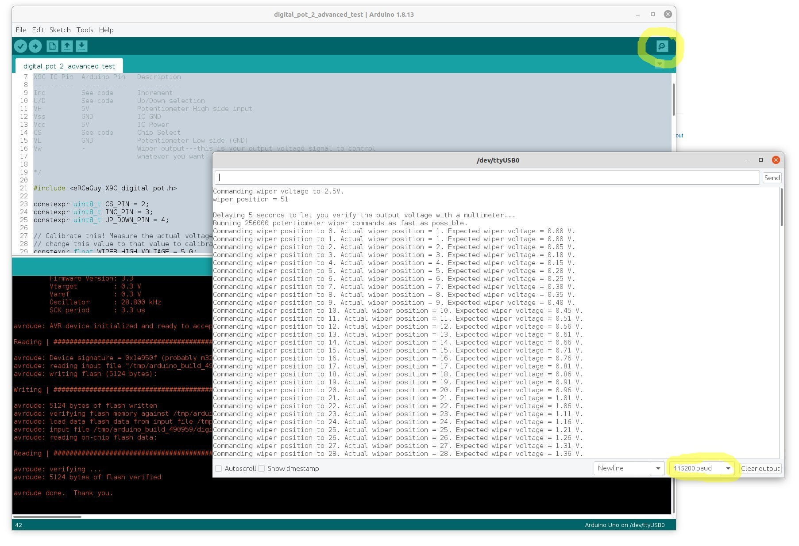

# eRCaGuy_X9C_digital_pot

Arduino library/driver for the Renesas X9C102 (1k), X9C103 (10k), X9C503 (50k), and X9C104 (100k) family of digital potentiometers.

Easily drive these 100-step digital potentiometers to any absolute or relative position.

By Gabriel Staples  
https://gabrielstaples.com  
www.ElectricRCAircraftGuy.com  

# Status

Library is done. It is complete and thorough, and it compiles and runs on an Arduino. 

However, it is untested with **actual X9C103 digital potentiometer hardware**, as I'm still waiting on it to arrive in the mail. 

Examples are written. Please take a look, try them out, and see if they work!

# License
MIT

# Screenshots

# Notes to self
- Reminder to follow this specification, folder layout, and to have a library.properties file or else Arduino won't accept and build your library! https://arduino.github.io/arduino-cli/latest/library-specification/ /////////////////////

WRITE BLOG POST ON ARDUINO LIBRARY FOLDER LAYOUT, THE ERROR MESSAGE, ETC.

_This library layout and structure conforms with the [Arduino Library specification 1.5 library format (rev. 2.2)](https://arduino.github.io/arduino-cli/latest/library-specification/)._

# TODO (delete when done--newest on bottom)
1. Write blog posts:
    1. How to make an Arduino library (focus on the mechanics and library specification, not really the code itself).
    1. Introducing this library briefly.
    1. Also do a [PPM library](https://github.com/ElectricRCAircraftGuy/eRCaGuy_PPM_Writer) intro while at it too.
